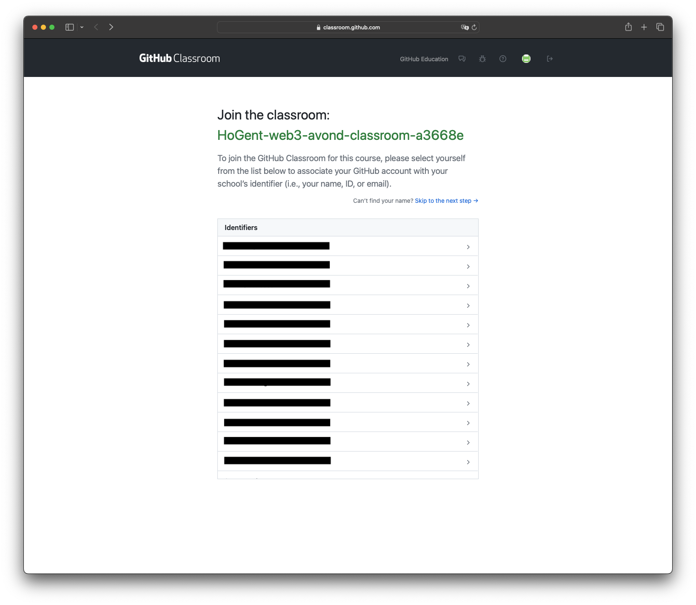
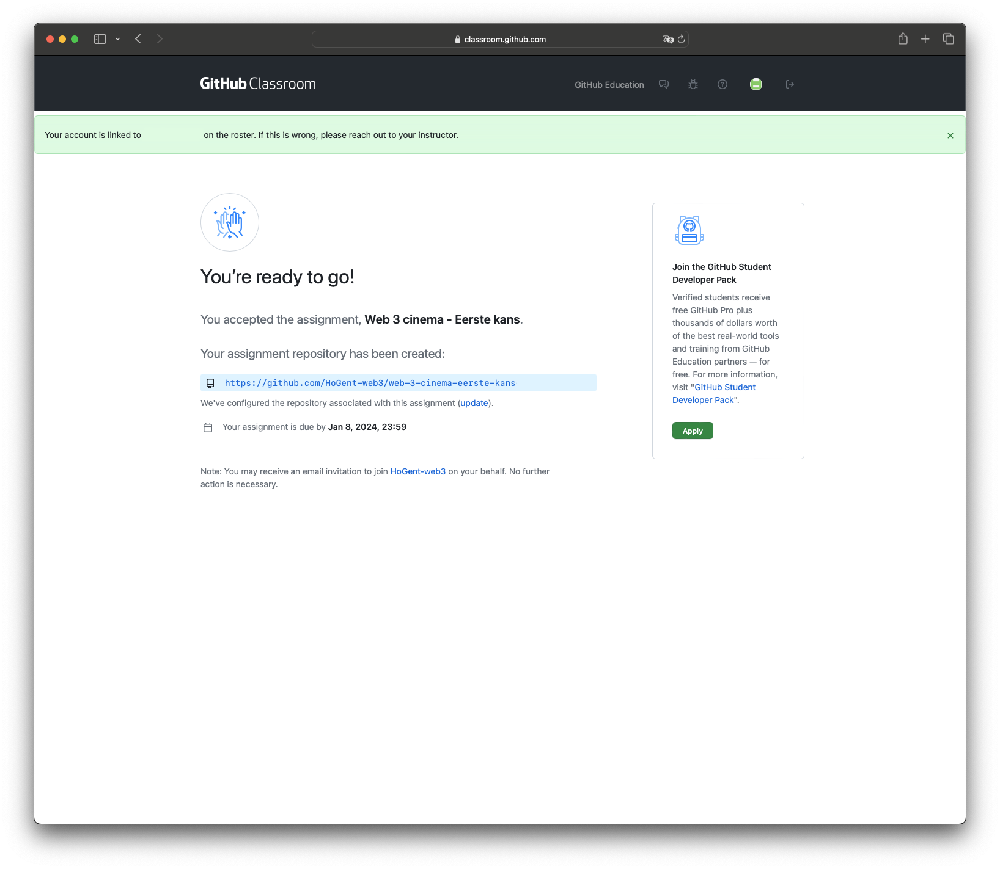
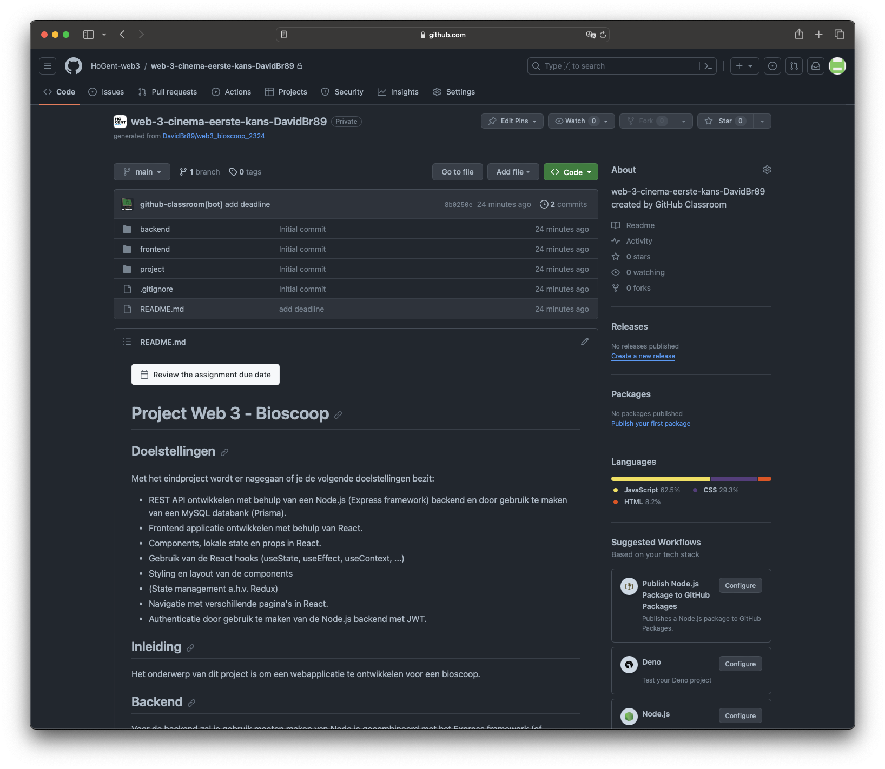

[](https://classroom.github.com/a/gwF8wGO0)
# Project Web 3 - Bioscoop

## Doelstellingen

Met het eindproject wordt er nagegaan of je de volgende doelstellingen bezit:

- REST API ontwikkelen met behulp van een Node.js (Express framework) backend en door gebruik te maken van een MySQL databank (Prisma).
- Frontend applicatie ontwikkelen met behulp van React.
- Components, lokale state en props in React.
- Gebruik van de React hooks (useState, useEffect, useContext, ...)
- Styling en layout van de components
- (State management a.h.v. Redux)
- Navigatie met verschillende pagina's in React.
- Authenticatie door gebruik te maken van de Node.js backend met JWT.

## Inleiding

Het onderwerp van dit project is om een webapplicatie te ontwikkelen voor een bioscoop.

## Backend

Voor de backend zal je gebruik moeten maken van Node.js gecombineerd met het Express framework (of gelijkaardig). De bedoeling is dat je een REST API server maakt, zodanig dat de frontend applicatie zijn data kan opvragen a.h.v. REST operaties.

Je zal ook een databank (MySQL, ProstgreSQL, MongoDB, ...) moeten aanmaken en deze koppelen aan uw Node.js backend. Je kan hiervoor gebruik maken van een ORM zoals Prisma (wat we in de lessen besproken hebben). Je krijgt hiervoor al reeds een relationeel gegevensmodel mee (terug te vinden in de project folder) maar je mag dit steeds uitbreiden met extra elementen.

[Relationeel gegevensmodel](./project/DB_schema.pdf)

### Structuur

Voor de structuur van uw backend is het aan te raden om gebruik te maken van de mappenstructuur die we tijdens de lessen gezien hebben, en die uiteindelijk in het startersproject gebruikt wordt.

[Backend](./backend/)

```
├── bin
│   ├── www
├── controllers
|   ├── index.js
├── middlewares
|   ├── index.js
├── routes
|   ├── index.js
├── prisma
|   ├── schema.prisma
├── .gitignore
├── app.js
├── package.json
```

> [!IMPORTANT]
> Let op de naamgeving van uw files in Node.js. Best practice maken we gebruik van snake_case voor onze files bvb. `users_routes.js` i.p.v. `usersRoutes.js`.

> [!IMPORTANT]
> Gebruik ook de nieuwere ES6 (of hoger) syntax en gebruik dus nergens het `var` keyword.

## Frontend

### Structuur

Alsook voor de structuur van uw frontend is het aan te raden om gebruik te maken van de volgende mappenstructuur:

[Frontend](./frontend/)

```
├── public
│   ├── ...
├── src
|   ├── assets
|   ├── components
|   ├── contexts
|   ├── navigation
|   ├── pages
|   ├── store
|   ├── utils
|   ├── App.css
|   ├── App.jsx
|   ├── index.css
|   ├── main.jsx
|   ├── index.css
├── .eslintrc.cjs
├── .gitignore
├── package.json
├── README.md
├── vite.config.js
```

> [!IMPORTANT]
> Let op de naamgeving voor React components. Dit verloopt steeds via Pascal case bvb. `HomeComponent.jsx` i.p.v. `homeComponent.jsx`.

> [!IMPORTANT]
> We gebruiken functional components in React en dus nergens geen class components. Dit omdat we anders geen gebruik kunnen maken van de React hooks.

## GitHub Classroom

Om de voortgang van het project kunnen te volgen is het **verplicht** om gebruik te maken van GitHub. Om het makkelijke en overzichtelijk te houden voor mij maak ik gebruik van GitHub Classroom waarbij er automatisch op jouw account een private repository aangemaakt wordt bij het aanvaarden van de assignment.

Ik heb hier ook automatisch toegang toe. Ik kan deze repositories heel simpel opvolgen en als er bijvoorbeeld problemen zijn kan ik ook veel makkelijker mee kijken met de code die je al hebt.

### Stappenplan

1. Surf naar volgende link [GitHub opdracht link](https://classroom.github.com/a/gwF8wGO0) en koppel jouw GitHub account aan de classroom.
2. Je krijgt in principe zoals te zien is in de afbeelding een lijst met namen te zien, klik op jouw naam zodanig dat de koppeling gemaakt kan worden. (Vanaf dit moment wordt jouw repository voor jou klaar gemaakt in uw account).



3. Je krijgt normaal gezien nog eens een bevestigingsscherm met de gegevens over de aangemaakt repository. Als je hierop door klikt kan je naar uw repository gaan en deze repository dus clonen via VSCode of manueel via de commandline.



4. Eénmaal in jouw persoonlijke repository kan je dus vanaf nu werken met deze repository. De bedoeling is dus dat je enkel en alleen uw project hierin maakt en regelmatig een commit doet van uw werk, dat ik dit makkelijk kan opvolgen.



> [!IMPORTANT]
> Er staat geen minimum op het aantal commits dat er nodig zijn. Maar om een zeker opvolging te hebben is het natuurlijk niet de bedoeling dat je maar 1 commit doet voor het volledige project. Je zal zoals bij elk project onder versiebeheer het beste genoeg commits doen.
